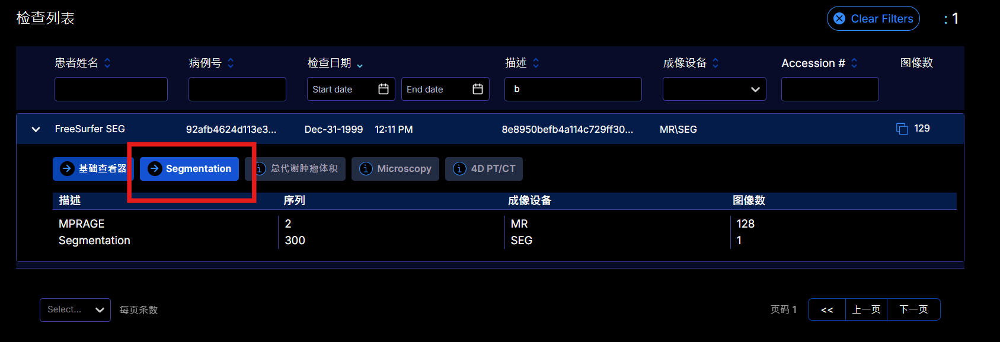
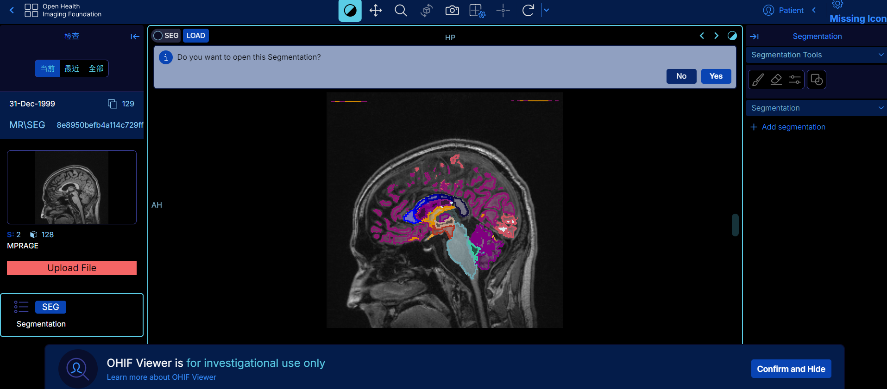
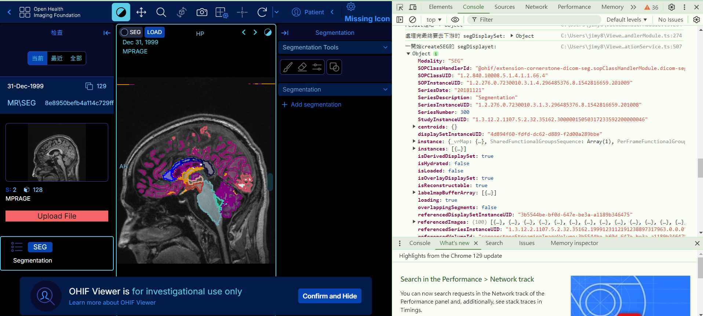

# OHIF-DeveloperNotes
此為研究OHIF Viewers功能的筆記，並非原作者!  
👍出處:[https://github.com/OHIF/Viewers](https://github.com/OHIF/Viewers)  

OHIF（Open Health Imaging Foundation）是一個開源的醫學影像檢視平台，由Massachusetts General Hospital開發，目標是提供一個整合的網頁系統來查看和分析醫學影像，  
目前有很多開發者投入研究，此為個人的研究筆記。  

👌目前理解了SegDisplayset的資料格式是一種buffer，有成功對改變顏色




```
git clone https://github.com/pix1506/OHIF-DeveloperNotes.git
cd OHIF
npm install --legacy-peer-deps
```

# 發現的功能(待整理)


